# PROJECT GRAPH

A dependency graph in four layers: **Evidence** feeds **Questions**, **Questions** feed
**Decisions**, **Decisions** feed **Goals** (G1 sales forecast, G2 inventory policy, G3 operations
plan for purchasing and production). Every fact behind a node's status is cited to DATA_MAP.md or
STATUS.md — this file states status and dependency, not new evidence.

Every future task reads this file first (CONVENTIONS.md, Part 4). When a task changes a node's
status, it updates this file (CONVENTIONS.md, Part 4).

## Critical path

**As of 2026-09-23, the critical path runs: E11 → E12 → Q10 → (blocks D9's resolution and every
downstream G2 figure).** Phase J found the Section 16 model fails calibration against actual
delivery performance (E11); Phase J2's four Explorers each tested a candidate explanation and each
falls short (E12); **how the business actually fulfils orders and how fast it replenishes (Q10)
remains unresolved** — and every G2 figure (Min, Max, stock_value, fill_rate, segment policy) is
marked UNCALIBRATED and depends on Q10 being answered before it can be trusted for a decision.

**Q10 update, 2026-09-23 (Phase J3): the data route was pursued to completion and gave a real,
per-division answer** (METRICS.md §20 inverse calibration, grid search independently confirmed —
V2, 12/12 figures match, `phaseJ3_validator2_independent_check.md`):

- **PEM101: PARTIALLY CALIBRATED.** A stock-based reorder policy (reorder level r, order-up-to
  level S, review interval, replenishment lead time) CAN reproduce both PEM101's 2024-2025 and
  2026+ `not_late` and stock value within tolerance, at a realistic capital level — 59 of 4,130
  grid combinations qualify. No single parameter is uniquely identified (r = 0.25-2.0 months of
  mean demand, S = 1.5-3.0 months, review interval = 1-30 days, lead time = 1-30 days all remain
  ambiguous), so this is usable for scenarios only with wide uncertainty bands, not a single
  confident policy.
- **PEM103: NOT CALIBRATABLE to a stock-based policy at a realistic capital level.** `not_late`
  alone CAN be matched (117 combinations), but every one requires 5-12x more stock value than the
  business actually holds (best: THB 57.6M simulated vs. THB 6.06M real). Corroborating evidence:
  69.3% of PEM103's delivered contracts trace to a pre-existing production-batch token (Explorer D,
  Phase J3) — far higher than PEM101's 2.0% — pointing toward batch/production-driven, not
  stock-buffer-driven, fulfilment.
- **PEM107: NOT CALIBRATABLE under any tested parameter set.** No stationary policy fits both
  periods simultaneously — the best joint compromise is still 14-18 percentage points off on one
  side. This implies a genuine operational change between 2024-2025 and 2026 (delivery performance
  dropped from ~87% to ~77%), not a search failure.

**Q10 is therefore substantially resolved for PEM101 (data-answerable, with named uncertainty) and
NARROWED to one specific named business question each for PEM103 and PEM107** (see the Gate detail
in `output/summary/phaseJ3_report.md` / STATUS.md's Phase J3 entry) — no longer the single, vague
"how does the business fulfil orders" question it was before J3. `cube_final` (the one remaining
purely-data route, batch dates/sizes for Q17) is still blocked — a second clean connection attempt
this session again returned 0 rows, contradicting the earlier "crashed session" explanation.

**G2's scope split, 2026-09-23 (business-confirmed division facts, DATA_MAP.md §7):** G2 (stock
policy) now covers **PEM101 and PEM107 only** — the two divisions whose fulfilment is genuinely
stock-driven. **PEM103 is moved out of G2 and into G3**, via a new tender-pipeline question node
(Q22): PEM103 is transformers, tendering-driven business for electricity utilities, consistent
with its 65.5% Tendering-channel value share, its 69.3% batch-traceability rate, and the 5-12x
capital gap found in J3 (DATA_MAP.md §7) — a stock-based policy was never the right frame for it.
**PEM104 is closed as a dead end (DE4)**: made to order by business model, no stock policy
applicable (DATA_MAP.md §7, superseding the earlier "insufficient data" framing). The
external-factors node (utility budgets, EGP bid announcements — previously deferred to Phase 3.2,
STATUS.md:5253) is raised to **relevant for PEM103, blocked on data**, since the tender pipeline is
now understood to be PEM103's primary production driver.

**Q23 update, 2026-09-24 (this task): ANSWERED.** Q23 asked whether the Omni Channel scope explains
observed stock and delivery behaviour, or whether production/stock shared with Tendering needs to
be included. It does not need to be included for forecasting or calibration purposes: widening the
demand scope to Omni+Tendering forecasts Omni demand no more accurately in any of the three
divisions (independently confirmed by a from-scratch Validator recomputation — same direction and
significance verdict in all 3, MAE within 3%), and makes PEM103's stock-based-policy calibration
gap WORSE (27-37x real capital under combined demand, vs J3's 5-12x Omni-only) rather than
resolving it — reinforcing Q22's tender-pipeline finding, not a shared-stock finding. PEM107's 2026
not_late decline (86.6%→76.5%) DOES coincide with a real, independently-confirmed channel-mix
reversal (Tendering value share 28-39%→72% in 2026) and a genuine drop in Omni's own not_late
(88.6%→76.5%, not merely a compositional artifact) — a supported, not proven, hypothesis (level H)
that shared capacity/stock was diverted toward Tendering in 2026. Omni Channel remains the
project's default scope regardless (decision unaffected). Full detail:
`output/summary/phaseQ23_{explorer,modeler,analyst,validator}_report.md`; STATUS.md Q23 entry.

**Channel-shift cause, resolved 2026-09-24 (a separate task, same day): tested directly whether the
above reversal is a recording change or a genuine business change.** Three independent checks (two
Explorers on different angles — order side: customers/items/timing; attribute side: order size/
notice/customer segment — plus a from-scratch Validator reading none of their files) all converge
on **BUSINESS change, for both PEM103 and PEM107 (V2)**: customer channel identity is essentially
fixed (no relabeling of existing customers), order size and a newly-established `customer_segment`
field show the tag tracks a real, stable institutional-vs-retail customer distinction in both
years, there is no clean step-change date (lumpy, contract-driven spikes in both years), and one
attribute (PEM107's Tendering notice days) genuinely changed between years. **The business's stated
view (level A, 2026-09-23: "most likely a recording-method change") is recorded as stated,
alongside this direct data contradiction — both positions stand, neither chosen** (AGENTS.md rule
4/9); recommended this go back to the business as a specific, falsifiable question (was there a
named system/process change, and on what date?). No reconstruction/reassignment rule was warranted;
no G1/forward-test correction was made; the PEM107 diversion hypothesis SURVIVES this test and is
strengthened on its "is the surge real" dimension (still level H). Full detail:
`output/summary/phase136_{explorer1,explorer2,synthesis,validator}_report.md`; DATA_MAP.md §7.

## Status legend

| Color | Status |
|---|---|
| Green | done |
| Yellow | in progress |
| Orange-red | blocked on data |
| Purple | blocked on a person |
| Orange, dashed border | uncalibrated |
| Dark grey | closed, no downstream use (dead end) |

## Graph

```mermaid
flowchart TD
    classDef done fill:#b7e4c7,stroke:#2d6a4f,color:#1b4332
    classDef inprogress fill:#ffe08a,stroke:#b08900,color:#5c4400
    classDef blockeddata fill:#ffb4a2,stroke:#a4133c,color:#590d22
    classDef blockedperson fill:#c9b6e4,stroke:#5a189a,color:#3c096c
    classDef uncalibrated fill:#f4a261,stroke:#e63946,color:#5c2a00,stroke-dasharray: 5 3
    classDef closed fill:#6c757d,stroke:#343a40,color:#ffffff

    subgraph EVIDENCE["Evidence (from DATA_MAP.md)"]
        E1["E1: pricelist authoritative\nfor division"]
        E2["E2: -OLD tags swapped\nPEM102/PEM107"]
        E3["E3: cost = line total"]
        E4["E4: createDate = PODate\n(99.95%)"]
        E5["E5: MPS = Cube_CES\nBacklog"]
        E6["E6: Cube_Backlog lags\nCube_CES ~13.6h"]
        E7["E7: jobcode/jobno/OLMJobCode\n= batch reference"]
        E8["E8: 6-day median\ncustomer notice"]
        E9["E9: existing min/max\nunusable as input"]
        E10["E10: item-to-warehouse reverse\nfinds PEM103/PEM107 stock"]
        E11["E11: Phase J calibration_gap\n-84 to -93pp"]
        E12["E12: Phase J2 4 Explorers -\nnone explain the gap"]
        E13["E13: 73.2% was on_time_exact,\nnot fill_rate-comparable"]
        E17["E17: six-model backtest,\nTop-down beats Naive 4/5 divisions"]
        E18["E18: PEM103 = transformers,\ntendering-pipeline business (A)"]
        EF1["EF1: utility budgets, EGP bid\nannouncements (external factors)"]
    end

    subgraph DEADENDS["Dead ends (closed, no downstream edge)"]
        DE1["DE1: Feb-Jul 2026 window\nanomaly - unresolved, stopped"]
        DE2["DE2: cross-division/Tendering\ncoverage outside pricelist scope\n- documented exclusion, not modelled"]
        DE3["DE3: quantity-clustering\nMOQ signal - business confirmed\nno MOQ data exists"]
        DE4["DE4: PEM104 - made to order,\nno stock policy applicable"]
    end

    subgraph QUESTIONS["Questions"]
        Q1["Q1: which division does\nan item belong to?"]
        Q2["Q2: is createDate the\nreal order date?"]
        Q3["Q3: what does MPS/Backlog\nmean across tables?"]
        Q4["Q4: which table sources\nconfirmed/open demand?"]
        Q5["Q5: what does jobcode\nrepresent?"]
        Q6["Q6: can existing min/max\nbe a policy input?"]
        Q7["Q7: which warehouses hold\nreal stock per division?"]
        Q8["Q8: what is the real\ncustomer order notice?"]
        Q9["Q9: does Section 16 reproduce\nactual delivery performance?"]
        Q10["Q10: HOW DOES THE BUSINESS\nACTUALLY FULFIL ORDERS?"]
        Q11["Q11: does quotation-based\nnotice explain the gap?"]
        Q12["Q12: are due dates aligned\nto delivery?"]
        Q13["Q13: does delivery come from\ncomponent stock/fast assembly?"]
        Q14["Q14: does production run\nin batches ahead of orders?"]
        Q15["Q15: what would Section 16\nneed to become?"]
        Q16["Q16: is 73.2% a valid\nfill_rate benchmark?"]
        Q17["Q17 (G3, proposed): production\nbatch cadence and size?"]
        Q18["Q18 (G3, proposed): BOM /\nshared components?"]
        Q19["Q19 (G3, proposed): assembly\nand inspection time?"]
        Q20["Q20 (G3, proposed):\nproduction capacity?"]
        Q21["Q21 (G3, proposed): MTS vs\nMTO vs ETO per item?"]
        Q22["Q22 (G3): PEM103 - does the\ntender pipeline govern production/\nstock behaviour?"]
        Q23["Q23: does Omni Channel scope\nexplain stock/delivery, or is\nshared Tendering stock needed?"]
    end

    subgraph DECISIONS["Decisions"]
        D1["D1: pricelist is authoritative\n(CONVENTIONS.md rule)"]
        D2["D2: adopt Top-down Combination\nforecasting at Type level"]
        D3["D3: PEM101 128-item scope\n= pilot, not project-wide"]
        D4["D4: use forecast_date-keyed\nfrozen-snapshot series"]
        D5["D5: sellable warehouse codes\n= stated ASSUMPTION"]
        D6["D6: METRICS.md is the single\nsource of truth for formulas"]
        D7["D7: segment policy formula\n(with zero-P50, infeasible amendments)"]
        D8["D8: robust-upper-bound Tier A\ndefaults REJECTED/deferred"]
        D9["D9: every E0/E1/E2/Phase I\nfigure marked UNCALIBRATED"]
    end

    subgraph TIMETRACKS["Time-bound tracks"]
        T1["T1: forward test first\nscoreable 2026-09-30"]
        T2["T2: posting-delay snapshot\nreaches 60 days ~2026-11-21"]
    end

    subgraph GOALS["Goals"]
        G1["G1: sales forecast"]
        G2["G2: inventory policy\n(PEM101, PEM107 only)"]
        G3["G3: operations plan\n(purchasing + production)"]
    end

    E1 --> Q1
    E2 --> Q1
    Q1 --> D1
    D1 --> D3
    D1 --> G1
    D1 --> G2

    E4 --> Q2
    Q2 --> D4
    D4 --> G1

    E5 --> Q3
    E6 --> Q4
    Q3 --> Q4
    Q4 --> D6

    E7 --> Q5
    Q5 -.-> D7

    E9 --> Q6
    Q6 --> D6
    E10 --> Q7
    Q7 --> D5
    D5 --> G2

    E8 --> Q8
    Q8 --> Q10

    E17 --> D2
    D2 --> G1
    D3 --> G1
    T1 --> G1

    E11 --> Q9
    Q9 --> Q10
    E12 --> Q10
    Q10 -.->|in progress, data route J3| Q15
    Q11 --> Q10
    Q12 --> Q10
    Q13 --> Q10
    Q14 --> Q10
    T2 --> Q10

    Q15 --> D8
    D8 --> D9
    D9 --> G2
    D6 --> G2
    D7 --> G2

    E13 --> Q16
    Q16 --> D6

    Q10 -.->|proposed| Q17
    Q10 -.->|scheduled in J3| Q18
    Q10 -.->|proposed| Q19
    Q10 -.->|proposed| Q20
    Q10 -.->|proposed| Q21
    Q10 -.->|PEM103 path, 2026-09-23| Q22
    Q10 -.->|PEM107 2026 decline| Q23
    Q17 -.-> G3
    Q18 -.-> G3
    Q19 -.-> G3
    Q20 -.-> G3
    Q21 -.-> G3
    G2 -.->|needed, not yet in the right form| G3

    E18 --> Q22
    EF1 -.->|blocked on data| Q22
    Q22 -.-> G3
    Q23 -.-> Q22

    class E1,E2,E3,E4,E5,E6,E7,E8,E9,E10,E11,E12,E13,E17,E18 done
    class DE1,DE2,DE3,DE4 closed
    class EF1 blockeddata
    class Q1,Q2,Q3,Q4,Q6,Q7,Q8,Q9,Q11,Q12,Q13,Q16 done
    class Q5,Q15,Q10,Q17 inprogress
    class Q18,Q22 done
    class Q14 blockeddata
    class Q19,Q20 blockedperson
    class Q21 inprogress
    class Q23 done
    class D1,D2,D3,D4,D6,D7,D8,D9 done
    class D5 uncalibrated
    class T1,T2 inprogress
    class G1 inprogress
    class G2 uncalibrated
    class G3 blockedperson
```

## Node table

| Node | Status | Depends on | Unblocks | Evidence for status | Blocker type |
|---|---|---|---|---|---|
| E1 | done | — | Q1 | DATA_MAP.md §2, division/-OLD tags; §4 Trap 2 | — |
| E2 | done | — | Q1 | DATA_MAP.md §1 (cube_Sale_APD), §4 Trap 2 | — |
| E3 | done | — | (feeds D6/METRICS.md §1 directly) | DATA_MAP.md §2, cost; §4 Trap 1 | — |
| E4 | done | — | Q2 | DATA_MAP.md §2, createDate/PODate | — |
| E5 | done | — | Q3 | DATA_MAP.md §2, status mapping; §4 Trap 4 | — |
| E6 | done | — | Q4 | DATA_MAP.md §1 (Cube_Backlog); §4 Trap 5 | — |
| E7 | done | — | Q5 | DATA_MAP.md §2, jobcode/jobno/OLMJobCode | — |
| E8 | done | — | Q8 | STATUS.md Business Findings, 6-day median notice | — |
| E9 | done | — | Q6 | DATA_MAP.md §1 (Cube_Inventory_Exact) | — |
| E10 | done | — | Q7 | DATA_MAP.md §3 Joins (warehouse↔division, reverse); §4 Trap 8 | — |
| E11 | done | — | Q9 | STATUS.md Phase J entry, calibration_gap | — |
| E12 | done | — | Q10 | STATUS.md Phase J2 entry; `output/summary/phaseJ2_synthesis_report.md` | — |
| E13 | done | — | Q16 | METRICS.md §19; DATA_MAP.md §4 Trap 12 | — |
| E17 | done | — | D2 | STATUS.md Phase C step 2 report, Top-down transferability | — |
| E18 | done | — | Q22 | DATA_MAP.md §7, PEM103 business model (A, business-confirmed 2026-09-23) | — |
| EF1 | blocked on data | — | Q22 | STATUS.md:5253, 5391-5392 (Phase 3.2 missing-data note); raised from deferred to relevant for PEM103 2026-09-23 since the tender pipeline is now understood to be PEM103's primary production driver. **Business-confirmed, 2026-09-24 (DATA_MAP.md §7): PEM103's tender pipeline has no structured data source; setting one up would be required.** Job names in order descriptions are a possible route to characterising past tender work, but exist only after a contract is awarded — they give history, not forward pipeline, so they cannot substitute for EF1. **Tested, 2026-09-24 (a later task): the job-names route is a weak, partial supplement, not a substitute — EF1 remains blocked on data.** Derived keyword patterns give precision 44.4%/recall 34.3% (narrow) or 35.8%/recall 82.9% (broad) against `revenue_type='Tendering'` (n=35, not a reliable classifier). The text does add a finer buying-entity geography and a formal bid-reference-code format beyond `revenue_type`, but no project-type distinction, and remains past-only. `output/summary/phase24_explorerD_report.md`. | **data** |
| DE1 | closed, no downstream use | — | (none — investigated and stopped) | STATUS.md, Modeler-tasks-1-3 log entry; reversal persists but is not chased further | — |
| DE2 | closed, no downstream use | — | (none — documented, not modelled) | `config/config.yaml` cross_division_excluded_value_thb comment; STATUS.md Locked Decisions | — |
| DE3 | closed, no downstream use | — | (none — business confirmed absent) | STATUS.md §8.3 "Removed from the data request list" | — |
| DE4 | closed, no downstream use | — | (none — business confirmed, no stock policy applies) | DATA_MAP.md §7, PEM104 business model (A, business-confirmed 2026-09-23); supersedes the earlier "insufficient data" exclusion reason (STATUS.md:4817-4824) | — |
| Q1 | done | E1, E2 | D1 | Answered — pricelist is authoritative | — |
| Q2 | done | E4 | D4 | Answered — createDate ≈ PODate, usable as order date | — |
| Q3 | done | E5 | Q4 | Answered — MPS = Cube_CES Backlog | — |
| Q4 | done | E6, Q3 | D6 | Answered — Cube_CES Status='Backlog', not Cube_Backlog table | — |
| Q5 | in progress | E7 | D7 (loosely) | Batch-reference meaning established; populating mechanism still unresolved (DATA_MAP.md §5 item 11) | data |
| Q6 | done | E9 | D6 | Answered — no, existing settings unusable as input | — |
| Q7 | done | E10 | D5 | Answered for division/sharing; sellability itself remains a standing assumption (DATA_MAP.md §5 item 9) | — |
| Q8 | done | E8 | Q10 | Answered — 6-day median, but Phase J2 found this doesn't explain real fulfilment speed | — |
| Q9 | done | E11 | Q10 | Answered — no, the model does not reproduce actual delivery performance | — |
| **Q10** | **in progress — answered per-division, 2026-09-23 (Phase J3)** | E12, Q8, Q9, Q11, Q12, Q13, Q14, T2 | Q15, D8, D9, G2 | METRICS.md §20 inverse calibration run and independently confirmed (V2, 12/12 figures match, `phaseJ3_validator2_independent_check.md`): **PEM101 partially calibratable** (59/4,130 combos fit both periods at a realistic stock level; no parameter uniquely identified). **PEM103 NOT calibratable to a stock-based policy at a realistic capital level** (needs 5-12x more stock value than held; 69.3% of its delivered contracts trace to a pre-existing production batch — points to batch-driven, not stock-driven, fulfilment). **PEM107 NOT calibratable at all** (no fixed policy fits both 2024-2025 and 2026 — implies a real operational change, not a search failure). Full detail: `output/summary/phaseJ3_2_calibration_summary.json`, STATUS.md Phase J3 entry. **PEM107 branch, CHECKED AGAINST DATA 2026-09-24 (a later task, same day): CONTRADICTED.** The
business-confirmed "shared production/stock, separated mid-2026" claim (DATA_MAP.md §7, level A)
does not match what the data shows: linking `cube_final.jobno` to `Cube_CES.OLMJobCode`, the
change point is **October/November 2024**, ~19-20 months earlier than stated, entirely outside the
officially-specified analysis window — dual-channel batch linkage is 0.00% every month from
November 2024 through September 2026 (independently confirmed by a from-scratch Validator: same
change point, same flat-zero window). The June 2026 `not_late` drop (84.3%→46.0%) does NOT coincide
with any batch-sharing signal, which was already flat for a year and a half by then. **Level V2**
(Validator match on the change point and the flat-zero window). Per AGENTS.md rule 4/9, both the
business's level-A statement and this direct contradiction are recorded, neither chosen —
recommended next step: ask the business a falsifiable question about the Oct/Nov 2024 timing.
`output/summary/phase24_explorerA_report.md`, `phase24_validator_report.md`,
`phase24_synthesis_report.md`.

**PEM107 branch, FURTHER TESTED 2026-09-25 (a later task, same day the business refined the date
to specifically May 2026): tested whether the Oct/Nov 2024 finding above is itself a linkage
artifact hiding the true May-2026 separation. Hypothesis FAILS — the linkage is not blind.** Four
parallel agents (linkage rate/format across the 2024 boundary; every categorical column for a
May-2026 break; Omni-vs-Tendering behaviour in two periods bracketing May 2026;
`cube_inventory_tran` warehouse-movement evidence) plus an independent Validator recomputing three
of their figures without reading their files, all converge: link rate/format stay stable across
Oct-Dec 2024 (V2, two independent agents match); one field (`cube_final.division`) steps
`103`→`107` at May/June 2026 but the identical pattern recurs a year earlier with no known cause
(undermines it as May-2026-specific, level H); no other column and no behavioural measure
(`not_late`, order-to-delivery, batch-traceability, manufacturing mix) shows a step at May 2026 —
the real `not_late` disruption starts in June and is volatile, not a discrete shift (V2, Validator
match on the headline figures); warehouse-movement data is too thin to test (24/136 items, 47 rows,
all dated 2021-12-14, none in 2025-2026). **Net: no reliable data trace of a May-2026 separation
exists. Per the task's own instruction for this outcome, the separation is treated as operational,
not captured by this project's data, and May 2026 is adopted as the split point for future PEM107
calibration on the business's authority alone (level A) — this does not reverse the Oct/Nov 2024
batch-sharing finding, which stands as the answer to a different question (when batch-sharing
itself stopped, not when the business considers the units administratively separated).**
`output/summary/phase25_explorer{1,2,4}_report.md`, `phase25_analyst3_report.md`,
`phase25_validator_report.md`; DATA_MAP.md §7. | data, largely resolved; PEM103/PEM107 each now have ONE narrow named business question (see PROJECT_GRAPH.md Part 4/Gate note below) |
| Q11 | done | (Explorer A) | Q10 | Contradicted — `output/summary/phaseJ2_explorerA_report.md` | — |
| Q12 | done | (Explorer B) | Q10 | Contradicted — `output/summary/phaseJ2_explorerB_report.md` | — |
| Q13 | done | (Explorer C) | Q10 | Contradicted as general explanation — `output/summary/phaseJ2_explorerC_report.md` | — |
| Q14 | blocked on data | (Explorer D) | Q10 | Partially supported; decisive test needs a re-pull of `cube_final.final_date` — `output/summary/phaseJ2_explorerD_report.md` | **data** |
| Q15 | in progress | Q10 | D8 | Proposed in words (synthesis report); not implemented, and not finalizable until Q10 answered | — |
| Q16 | done | E13 | D6 | Answered — no, corrected `not_late` figures now used instead | — |
| Q17 | in progress | Q10 (implicitly) | G3 | Advanced 2026-09-23 (Phase J3 Explorer D): per-item-typical cadence now known per division (median 36-58 days, wide spreads) and the reverse-traceable batch share is known per division (PEM101 2.0%, PEM103 69.3%, PEM107 58.9%). **Unblocked, 2026-09-24 (this task, Part 0): `cube_final`'s itemcode join now works (DATA_MAP.md §4 Trap 7, resolved) — 75.21% forward match rate for the 351-item scope (PEM101 87.50%/PEM103 36.78%/PEM107 88.24%), 28,000 real rows pulled. Batch DATES and SIZES themselves have not yet been extracted/analysed from these rows — that extraction is the next step, not yet done.** | data (a working `cube_final` connection — now confirmed working; batch date/size extraction itself not yet done) |
| **Q18** | **done, 2026-09-23 (Phase J3 Explorer BOM)** | Q10 (implicitly) | G3 | Fully investigated: structure/grain confirmed, 85.8% coverage of the 351-item scope (PEM103 only 58.6%), components confirmed SHARED across finished items (141/805, 17.5%), join to `Cube_Inventory_Exact` confirmed both directions (V2, 95.0%). `output/summary/phaseJ3_explorerBOM_report.md`. | — |
| Q19 | blocked on a person (assembly half); a narrower inspection-lag proxy exists | Q10 (implicitly) | G3 | Proposed this task, Part 3. **Tested 2026-09-24 (a later task): CANNOT BE DETERMINED FROM THIS DATA, now on a stronger footing (a live-reverified 35-column schema check, not just "not analysed") — no field anywhere in `cube_final` marks assembly/production start.** A narrow, explicitly-labelled `final_date`→`finalcheck_date` post-completion **inspection-lag** proxy is measurable (median 0.015–0.90 days by division) but is NOT assembly time. An independent Validator pass chose a different pair (`final_date`→`fg_final_date`, median 3.03 days) without checking that 86.6% of its populated rows carry `cube_final`'s own `division='102'` tag (a different production line, outside this project's scope) — DATA_MAP.md §4 Traps 21-22 traces this discrepancy; the inspection-lag proxy is the one adopted. `output/summary/phase24_explorerC_report.md`. | **person** (for real assembly time) |
| Q20 | blocked on a person (true capacity ceiling); a lower-bound proxy exists | Q10 (implicitly) | G3 | Proposed this task, Part 3. **Tested 2026-09-24 (a later task): a lower-bound proxy is now available.** Monthly `transfer_qty` output (not `job_qty`, confirmed a fixed lot-size constant, 94.9% of `jobno` values repeat one number): highest sustained monthly output PEM101 ~249,080 units/month, PEM103 ~405/month, PEM107 ~6,221/month, PEM104 ~4/month (too thin to trust). **Explicitly a lower bound on capacity, not capacity itself** — the business could have run below its true ceiling in every observed month. `output/summary/phase24_explorerC_report.md`. | **person** (for the true ceiling) |
| Q21 | **partial — usable derived classification, confidence varies by division (corrected 2026-09-24)** | Q10 (implicitly) | G3 | Proposed this task, Part 3; data route tried 2026-09-23 (value meanings recorded, DATA_MAP.md §2, level A). **Data route run to completion, 2026-09-24 (a later task): per-item dominant-type classification (by quantity share, <60%=mixed) computed and tested against real behaviour.** Dominant counts (independently confirmed EXACT match by a Validator, level V2): PEM101 83 MTS/20 MTO/0 ETO/10 mixed; PEM103 34/11/0/5; PEM107 25/78/0/9. Behaviour match (level V1): **PEM107 matches well on every dimension; PEM103 matches on timing/batching but not physical stock-holding (only 41.2% of dominant-MTS items hold any stock); PEM101 only partial (batch-timing near-zero for both labels).** PEM104 cross-check AGREES with its made-to-order status. `output/summary/phase24_explorerB_report.md`, `phase24_validator_report.md` Sec.2. | data route exhausted for a first-pass classification; **person** only if higher confidence is needed for PEM101/PEM103 specifically |
| Q22 | **answered (level A)** — production mechanism pending EF1 | E18, Q10 (PEM103 path) | G3 | Business-confirmed PEM103 is transformers, tendering-pipeline-driven business (DATA_MAP.md §7); its production/stock behaviour follows awarded tenders, not a stock-based reorder policy — this is a business-confirmed statement (level A), not itself derived from data. **How the pipeline actually governs batch timing against the tender pipeline is NOT yet established** — that mechanism still needs EF1 (external factors: utility budgets, EGP bid announcements — blocked on data; EF1's own job-names test, 2026-09-24, found no substitute route exists — see EF1's row above). Q23 (below) reinforces this from the data side: PEM103's combined-demand calibration gap WIDENS (27-37x capital vs J3's Omni-only 5-12x), evidence against a stock-buffer explanation regardless of demand scope. | data (EF1) |
| Q23 | **done — answered, 2026-09-24; channel-shift cause resolved 2026-09-24** | Q10 (PEM107 path) | Q22, Q10 (PEM107 2026 decline) | **Answered: the Omni Channel scope is not the problem — widening to Omni+Tendering does not explain PEM103/PEM107's stock/delivery behaviour better, and forecasts Omni demand no more accurately (worse for PEM107, t=2.43, and PEM103's dominant focus item, independently confirmed by a from-scratch Validator recomputation — same direction/significance in all 3 divisions, MAE within 3%).** PEM103's combined-demand calibration gap WIDENS (27-37x real capital, vs J3's Omni-only 5-12x) — reinforces Q22, not a shared-stock finding. PEM107's 2026 not_late decline (86.6%→76.5%) coincides with a real, independently-confirmed channel-mix reversal (Tendering value share 28-39%→72% in 2026) AND a genuine drop in Omni's own not_late (88.6%→76.5%) — a supported hypothesis (level H) that shared capacity was diverted toward Tendering, not proven. Omni Channel remains the project's default scope (decision unaffected by this finding). **Follow-up, 2026-09-24 (a separate task): the channel-mix reversal's CAUSE was tested directly — three independent checks (two Explorers, different angles, plus a from-scratch Validator) converge on a BUSINESS change, not a recording change, for both divisions (V2).** The business's stated view (level A: "most likely a recording-method change") is recorded alongside this direct data contradiction, per AGENTS.md rule 4/9 — both stated, neither chosen; recommended this go back to the business as a specific, falsifiable question. No G1/forward-test correction warranted on these grounds. The PEM107 diversion hypothesis SURVIVES this test and is strengthened on its "is the surge real" dimension (still level H, not proven). Full detail: `output/summary/phaseQ23_{explorer,modeler,analyst,validator}_report.md`; `output/summary/phase136_{explorer1,explorer2,synthesis,validator}_report.md`; DATA_MAP.md §7; STATUS.md Q23 and Phase 136 entries. | — |
| D1 | done | Q1 | D3, G1, G2 | CONVENTIONS.md, Data Correctness rule | — |
| D2 | done | E17 | G1 | STATUS.md Locked Decisions, "Final forecasting method" | — |
| D3 | done | D1 | G1 | STATUS.md Locked Decisions, "Project scope correction" | — |
| D4 | done | Q2 | G1 | STATUS.md Locked Decisions, series key | — |
| D5 | uncalibrated | Q7 | G2 | Standing business assumption, never confirmed by any field (DATA_MAP.md §2, warehouse field) | — |
| D6 | done | Q4, Q6, Q16 | G2 | METRICS.md header; CONVENTIONS.md | — |
| D7 | done | Q5 (loosely) | G2 | METRICS.md §15, incl. 2026-09-22/2026-09-23 amendments | — |
| D8 | done | Q15 | D9 | STATUS.md Phase J2 Part 0 entry (revert) | — |
| D9 | done | D8 | G2 | STATUS.md banner + per-phase tags | — |
| T1 | in progress | — | G1 | STATUS.md, "First scoreable target month is 2026-08, safe to score only from 2026-09-30" | time |
| T2 | in progress | — | Q10 | STATUS.md, "Prospective posting-delay measurement: STARTED 2026-09-22" (+60 days ≈ 2026-11-21) | time |
| **G1** | in progress | D1, D2, D3, D4, T1 | — | Forecasting method adopted and locked; Phase F (compare against the team's current method) not started. **PEM103/PEM107 checked 2026-09-24 for a channel-mix recording bug that would require correcting the Omni forecast/forward-test log before the 2026-09-30 scoring — NONE found; no correction made, 2026-09-30 scoring proceeds unlabelled/not provisional on these grounds** (`output/summary/phase136_synthesis_report.md` §4). A pre-existing, separate caution is reaffirmed, not newly created: PEM103/PEM107's Omni-only series is driven by a churning customer population placing lumpy, large, tender-adjacent orders — wide uncertainty bands remain warranted on these two divisions' point forecasts specifically. | time (Phase F) |
| **G2** | **uncalibrated — scope split 2026-09-23; PEM101 curve target selector built 2026-09-24** | D1, D5, D6, D7, D8, D9 | G3 (partially) | **Scope now PEM101 and PEM107 only** (business-confirmed fulfilment is stock-driven for these two, DATA_MAP.md §7). PEM103 moved out — feeds G3 via Q22 (tender-pipeline) instead. PEM104 was never in scope for stock policy — see DE4. Phase J's calibration_gap; every figure banner-tagged in STATUS.md. **METRICS.md §22 robust_minmax, corrected 2026-09-24 (a later task, same day): the prior 139-member ensemble double-counted 59 parameter tuples shared between two usable-stock definitions — only 80 are simulation-distinct (`output/summary/phase22_validator_report.md` Part 1; DATA_MAP.md §4 Trap 20). METRICS.md §22 now deduplicates on only the parameters that affect the computed quantity. Recomputed on the 80 distinct members: every item still returns the SAME range_ratio (≈8.0, driver `r_months`), carrying no item-level information — the robust/sensitive table was REMOVED from the page (Part 5) and replaced by a note that the data cannot identify a reorder level; choosing a not_late target is what sets it. The trade-off curve (locked grid/window in `config.yaml`'s `trade_off_curve` block, so the Modeler and an independent Validator agree to floating-point tolerance, not just magnitude) still sits close to today's point (median curve at 98% bin: THB 17.21M, 6.00% below today's THB 18.25M; median curve's not_late at today's stock value: ~98.2%, 0.1pp below today's 98.28%) — the 97%-bin median moved materially (THB 16.45M → THB 14.82M, dedup fix), the 98%-bin median barely did (−0.1%). Full detail: `output/summary/phase23_modeler_report.md`, `phase23_validator_report.md`.** **PEM101 value statement, refined 2026-09-24 (a later task, same day): the apparent 7.25% saving at today's service level (THB 16.93M model-median vs. THB 18.25M actual) is NOT distinguishable from zero, given both the trade-off curve's own very wide across-member band (119-148% of the median, depending on the exact reorder level) and METRICS.md §20's ±15% stock-value calibration tolerance — independently confirmed by a from-scratch Validator (band within 1-4% of the Modeler's own, same conclusion). PEM101 is operating on the efficient curve within the model's resolution — a statement about what the model can currently distinguish, not a claim that no real efficiency gain is possible. Cost of moving to a 99% stretch target: THB 4,372,760.99 (25.8% increase), itself well inside both presets' own wide bands. `output/summary/phase24_modeler_part2_report.md`, `phase24_validator_report.md` Sec.4, `phase24_synthesis_report.md`.** | data, pending J3 (Q10) — corrected 2026-09-23, was "person"; **the service-level choice, corrected 2026-09-24 (same day, later): the "option to be built" is now BUILT — PEM101's inventory page offers 3 presets plus a free not_late-target slider (interpolating a Python-precomputed dense grid, never simulating client-side), showing per-item Min/Max, total stock value with its envelope band, and the change vs today's on-hand for whatever target is selected. The business chooses directly on the page; nothing here blocks the pipeline any further.** |
| **G3** | blocked on a person | Q17-Q21 | — | No question nodes existed before this task; all proposed, none answered | **person** |

## Time-bound tracks (detail)

- **T1 — forward test.** `output/summary/forward_test_log.csv` logs real forecasts as they are
  made; the leakage-guard margin (30 days) makes 2026-08 the first target month, **safe to score
  only from 2026-09-30** (STATUS.md, "Forward-test scoring for the 335-item log"). Feeds G1's own
  validation, independent of Phase F.
- **T2 — posting-delay snapshot.** `src/snapshot_daily.py`, a Windows Scheduled Task, started
  **2026-09-22**; the leakage-guard margin cannot be revisited until **≥60 days of daily snapshots
  exist and the script's own p99 is known from that data** (STATUS.md, "Prospective posting-delay
  measurement: STARTED 2026-09-22") — reaches 60 days around **2026-11-21**. Feeds Q10 (helps
  characterise real posting/entry lag, one input to the fulfilment-mechanism question).

## Dead ends (detail)

- **DE1 — the February to July 2026 window anomaly.** The createDate-vs-forecast_date reversal in
  rolling-origin backtesting was tested against three candidate causes (back-dating, the dominant
  focus item, order-timing/concentration) and none fully explained it; STATUS.md records this as a
  **known limitation, not chased further** — it directly motivated treating rolling-origin as
  PRIMARY and the single train/val/test split as SECONDARY ONLY, but has no further downstream
  investigation node.
- **DE2 — cross-division demand / coverage outside the pricelist-based Omni-Channel scope.**
  ₿60.6M (14.3%) of sales for the pilot codes sits under other divisions/channels; once
  channel/status are held fixed, the real Omni-Channel-scope exclusion is only ₿2.96M (0.42%) —
  **documented as a known exclusion, not modelled further** (`config/config.yaml`
  `cross_division_excluded_value_thb`).
- **DE3 — minimum order quantity / lot size.** 68 of 82 testable items showed quantity-clustering
  suggestive of a lot size, but the business confirmed this data does not exist at all — **removed
  from the data request list**, the suggestive evidence is kept on record but no value was ever
  set from it (STATUS.md §8.3).
- **DE4 — PEM104, made to order, no stock policy applicable.** Business-confirmed 2026-09-23
  (DATA_MAP.md §7): PEM104 is made to order, consistent with only 12 transactions across 17
  calendar months (STATUS.md:4819) and essentially no stock anywhere (STATUS.md:780-781). This
  supersedes the earlier "insufficient data" framing of PEM104's exclusion (STATUS.md:4817-4824,
  DATA_MAP.md §6 Corrections log) — the low transaction count is a structural consequence of the
  business model, not a data-collection gap. **Closed, no downstream use**: no stock policy (G2)
  or production-batch question (G3) applies.

## Part 3 — G3's question nodes (proposed, pending business confirmation)

G3 (operations plan for purchasing and production) has had no question nodes until this task —
which itself means it was unknown what an operations plan needs from G2. Working backwards from
what a purchasing/production plan must decide (what to order or produce, how much, and when), five
question nodes are proposed below. **All five are PROPOSED ONLY — none is answered here, per task
instruction.**

| Node | Question | Evidence in the database | Notes |
|---|---|---|---|
| Q17 | What production batch cadence and size does each item/family run on? | **Partial, advanced 2026-09-23 (Phase J3).** Cadence now known (per-item-typical median: PEM101 56d, PEM103 36d, PEM107 58d, wide spreads) and reverse-traceable batch share known per division (2.0%/69.3%/58.9%). Batch SIZE and exact dates still absent — a second, clean `cube_final` connection this session again returned 0 rows (contradicting the earlier "crashed session" theory), so this remains a diagnosed, not fixed, data gap (`output/summary/phaseJ3_explorerD_report.md` names the 3 diagnostic queries to run first). | Feeds Q10's PEM103/PEM107 findings directly; still blocked on a working `cube_final` pull. |
| Q18 | What bill of materials and shared components exist across items? | **Resolved, 2026-09-23 (Phase J3 Explorer BOM).** Structure/grain confirmed; 85.8% coverage of the 351-item scope (PEM103 only 58.6%); components confirmed SHARED across finished items (141/805 components, 17.5%, concentrated in fuse/surge-arrester families); join to `Cube_Inventory_Exact` confirmed both directions (95.0%, V2). 14 of Phase J2's 16 zero-finished-stock-fast-delivery items have at least one stocked component — PLAUSIBLE (not fully verified as causal) support for a component-stock explanation of that narrow pocket. | Feeds Q10/Q13 (component-stock hypothesis) directly. `output/summary/phaseJ3_explorerBOM_report.md`. |
| Q19 | What is assembly and inspection time per item? | **Assembly: still CANNOT BE DETERMINED FROM THIS DATA, now confirmed on a live-reverified 35-column schema check (2026-09-24) — no field anywhere in `cube_final` marks assembly/production start.** DATA_MAP.md §4 Traps 21-22 record two rejected candidate pairs (a wrong early-stage assumption; a 1-hour system-artifact pair) and a narrow, explicitly-NOT-assembly-time **inspection-lag** proxy (`final_date`→`finalcheck_date`, median 0.015–0.90 days by division) that IS measurable. `output/summary/phase24_explorerC_report.md`. | Assembly: needs the business. Inspection lag: usable now, with its narrow scope stated. |
| Q20 | What is production capacity (lines, labour, equipment) over time? | **A lower-bound proxy now exists, 2026-09-24.** Monthly `transfer_qty` output (`job_qty` confirmed unusable — a fixed lot-size constant, 94.9% of `jobno` repeat one value): highest sustained monthly output PEM101 ~249,080/month, PEM103 ~405/month, PEM107 ~6,221/month, PEM104 ~4/month (too thin). **Explicitly a lower bound, not the true ceiling** — the business could have run below capacity in every observed month. `output/summary/phase24_explorerC_report.md`. | True ceiling still needs the business; the lower-bound proxy is usable now for a floor estimate. |
| Q21 | Which items are made-to-stock vs. made-to-order vs. engineer-to-order? | **Data route run to completion, 2026-09-24 — a usable derived classification now exists, confidence varies by division.** Dominant type per item (by quantity share, <60%=mixed), independently confirmed EXACT match by a Validator: PEM101 83 MTS/20 MTO/0 ETO/10 mixed; PEM103 34/11/0/5; PEM107 25/78/0/9. Tested against real behaviour (stock, notice, delivery, batch-before-PO): **PEM107 matches well on every dimension; PEM103 matches on timing/batching but not physical stock-holding; PEM101 only partial.** PEM104 cross-check agrees with its made-to-order status. `output/summary/phase24_explorerB_report.md`, `phase24_validator_report.md`. | Usable now for PEM107 with high confidence, PEM103/PEM101 with stated caveats; business confirmation would raise confidence further but is not blocking a first-pass use. |
| Q22 | Does PEM103's tender-awarded pipeline govern its production/stock behaviour? | **Answered, 2026-09-23 (business-confirmed).** PEM103 is transformers, tendering-driven business (DATA_MAP.md §7) — consistent with 65.5% Tendering-channel value share, 69.3% batch-traceability, and the 5-12x stock-policy capital gap found in J3. | Replaces PEM103's place in G2 (stock policy) — feeds G3 instead. What governs batch timing/size against the tender pipeline still needs EF1 (external factors: utility budgets, EGP bid announcements — blocked on data). |
| Q23 | Does the Omni Channel scope explain observed stock and delivery behaviour, or does production/stock shared with Tendering need to be included? | **Answered, 2026-09-24 (Explorer/Modeler/Analyst, independently cross-checked by a from-scratch Validator — METRICS.md §21).** NO evidence that widening scope helps: Omni+Tendering forecasts Omni demand no more accurately anywhere (worse for PEM107, t=2.43, and PEM103's calibration gap WIDENS to 27-37x real capital under combined demand, vs J3's 5-12x Omni-only). PEM107's 2026 not_late decline (86.6%→76.5%) DOES coincide with a real channel-mix reversal (Tendering value share 28-39%→72%) and a genuine Omni-only not_late drop (88.6%→76.5%) — a supported (not proven) diversion hypothesis, level H. Channel mix itself (PEM103/PEM107, 2025/2026) is V2: independently recomputed twice (Explorer, Validator), exact agreement. **Cause of the reversal itself, resolved 2026-09-24 (separate task): three independent checks converge on a BUSINESS change, not a recording change (V2), against the business's stated view (level A) — both recorded, neither chosen. Diversion hypothesis survives, strengthened on its "is it real" dimension.** | Feeds PEM103's G3 path (Q22 — reinforces it, does not change it) and closes the data-route side of PEM107's 2026 delivery decline (Q10) with a supported-not-proven diversion hypothesis. Omni Channel stays the default scope (STATUS.md decision, unaffected by this finding). Full detail: `output/summary/phaseQ23_{explorer,modeler,analyst,validator}_report.md`; `phase136_{explorer1,explorer2,synthesis,validator}_report.md`. |

### What G3 would consume from G2, and whether the current form fits

G3 (an operations plan for purchasing and production) would consume, from G2: **Min, Max, and
segment policy (finished_goods_stock / component_stock_ato / component_stock_ato_infeasible /
placeholder / excluded) per item**, and ideally `stock_value` and `fill_rate` as decision-quality
signals.

**The current G2 outputs are not yet in the form G3 needs, for three stated reasons:**

1. **G2's own figures are UNCALIBRATED** (D9, this graph) — Phase J found the model that produces
   Min/Max/stock_value/fill_rate does not reproduce actual delivery performance. An operations plan
   built on uncalibrated Min/Max would be planning against a policy the business doesn't actually
   run. G3 cannot safely consume G2's numbers until Q10 is answered.
2. **G2's segment policy answers "how should this item be stocked," not "when and how much to
   produce."** Min/Max describes a target inventory POSITION; it says nothing about batch timing,
   batch size, or production sequencing — the actual decisions G3 needs to make (Q17-Q20 above).
   Even a fully calibrated G2 would need to be paired with the G3 question nodes' answers before it
   becomes an operations plan.
3. **Segment policy is a per-item, not a per-batch or per-production-line, unit.** G3 likely needs
   items GROUPED by shared component/BOM (Q18) and by production line/family (Q17, Q20) — a
   different aggregation than G2's per-item Min/Max, which would need to be re-rolled-up, not used
   item-by-item, once that grouping is known.

**What is missing, stated plainly**: everything in the Q17-Q21 row above that is "Absent" or
"Partial" — assembly/inspection time, capacity, batch cadence/size, and a reliable (not
order-level) make-to-stock/make-to-order classification. None of this can be manufactured from the
tables already queried by this project; each needs either a successful deeper pull (the `cube_final`
production-stage dates) or business input (capacity, BOM content read in full, assembly/inspection
time, the real MTS/MTO/ETO split).
